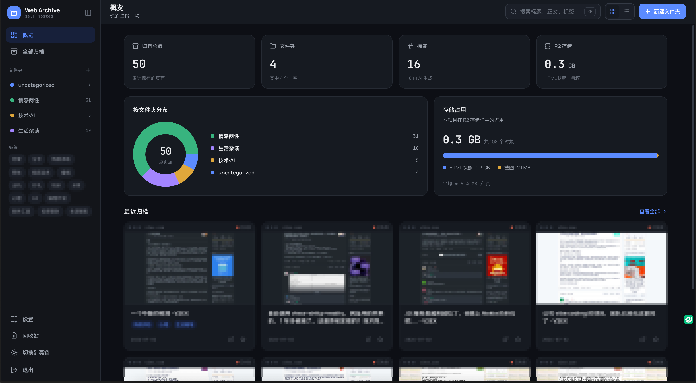
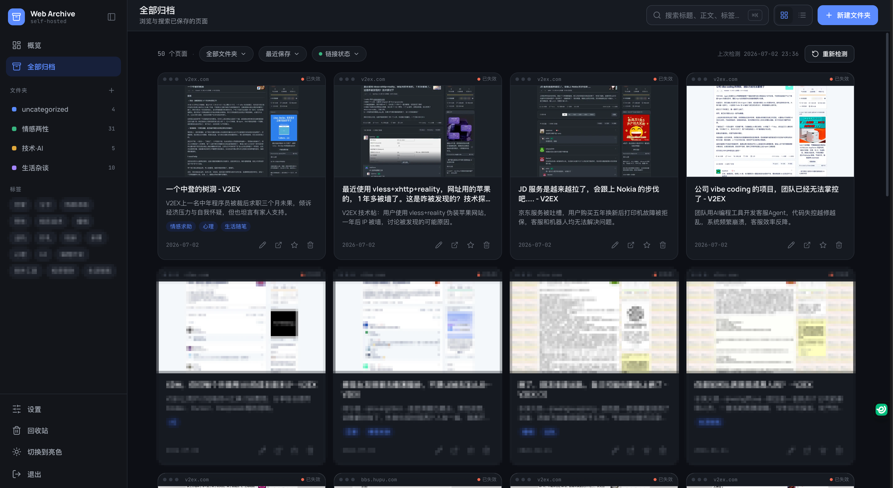
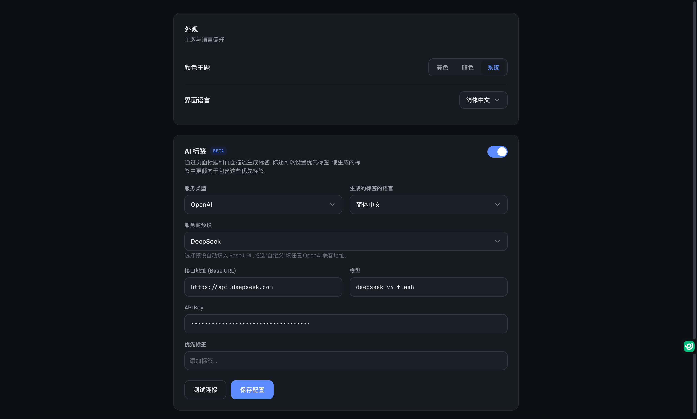

# Web Archive

自托管的网页归档服务，整套跑在 Cloudflare 上（Pages + D1 + R2 + Workers AI，免费额度即可）。浏览器插件一键把网页存成单文件 HTML，后台提供全文搜索、AI 标签、链接健康检测。

> 本项目 fork 自 [Ray-D-Song/web-archive](https://github.com/ray-d-song/web-archive)，感谢原作者的出色工作 🙏
> 此 fork 重做了整个管理界面并新增了若干功能；如需更通用、文档更完整的版本，请优先使用原仓库。



## 功能

沿自原版：

- 浏览器插件抓取整页（单文件 HTML + 截图），上传到自己的 Cloudflare
- 文件夹分类、标签、阅读模式、公开 Showcase 分享
- 移动端适配

此 fork 新增 / 重做：

- **全新管理界面** — 明暗双主题，概览仪表盘（归档统计、文件夹分布、R2 占用）
- **全文搜索** — 标题 / 正文 / 标签三路命中（D1 FTS5 trigram 索引），正文命中带关键词高亮摘要
- **链接健康检测** — 一键探活原始链接，标记 有效 / 已失效 / 已跳转
- **⌘K 命令面板** — 全局快速跳转与搜索
- **AI 自动补全** — 保存时自动生成页面描述和带 emoji 的标签（Workers AI 或任意 OpenAI 兼容接口）
- **快照版本** — 同一 URL 重复保存时可选覆盖或存为新版本
- 回收站保留 30 天自动清理，支持单条永久删除

## 截图

| 登录 | 全部归档 |
| --- | --- |
|  |  |

| 概览 | 设置 |
| --- | --- |
|  |  |

## 部署（Cloudflare）

具体命令以 [docs/deploy.md](docs/deploy.md) 和各包 `package.json` 为准，流程概括：

1. 准备 Cloudflare 账号，创建 D1 数据库和 R2 存储桶。
2. 将 `packages/server/wrangler.raw.toml` 复制为 `packages/server/wrangler.toml`，填入自己的 D1 `database_id`（该文件不入库）。
3. `npm install && npm run build:service`，产物在 `dist/service`。
4. 应用数据库迁移：`npx wrangler d1 migrations apply <数据库名> --remote`。
5. 发布：`npx wrangler pages deploy dist/service/src --project-name <项目名>`，再到 Cloudflare 后台绑定 D1 / R2 / AI 与自定义域名。
6. 浏览器插件：`npm run build:plugin`，在浏览器扩展管理页加载构建产物，填入服务地址与密钥即可开始归档。

首次登录输入的密钥（至少 8 位）会自动成为管理员密码。

也可以用仓库自带的 [Dockerfile](Dockerfile) 在本机以 node-cf-worker 模拟运行，不依赖 Cloudflare 账号。

## 开发

需要 node 20+，包管理用 npm（workspaces）：

```bash
npm install
npm run init:local   # 初始化本地 D1
npm run dev:server   # 后端 :9981
npm run dev:web      # 前端 :7749
npm run dev:plugin   # 浏览器插件
```

代码结构与约定见 [docs/contribute.md](docs/contribute.md)。

## 致谢与许可

- 原项目：[Ray-D-Song/web-archive](https://github.com/ray-d-song/web-archive)（作者 [Ray-D-Song](https://github.com/ray-d-song)、[banzhe](https://github.com/banzhe)）
- License：ISC，沿用原仓库
